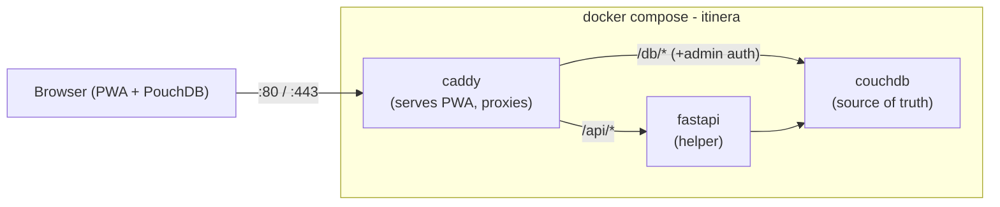

# Itinera — Deployment

The whole Itinera stack in **one folder, one command**. Copy the repo to any PC with Docker and bring the app online: the **Caddy** reverse proxy serves the built **PWA** and proxies to **CouchDB** (source of truth) and a **FastAPI** helper.



---

## Run it (fresh PC)

Prerequisites: **Docker Desktop / Docker Engine** with the Compose plugin.

```bash
cd itinera/deploy
cp .env.example .env        # then edit COUCHDB_PASSWORD
docker compose up --build -d
```

Open **http://localhost** (or `http://localhost:<HOST_HTTP_PORT>` if you changed the port).

> **Prefer encrypted transport.** Out of the box the app is served as **plain HTTP** on `:80` across the raw LAN**, so the admin Basic-auth header Caddy injects and all your personal trip data travel in **cleartext** to anyone sniffing the network. Keep `localhost` as the zero-config default, but for anything beyond this machine prefer one of:
>
> - **Tailscale TLS (recommended):** `tailscale serve --bg http://localhost:80`, then reach it at `https://<host>.<tailnet>.ts.net` (encrypted on the tailnet – see *Remote access*)
> - **Bind to the tailnet IP only:** publish the port on your Tailscale address instead of every interface – e.g., `ports: ["100.x.x.x:${HOST_HTTP_PORT}:80"]` in `docker-compose.yml` so the plain-HTTP port isn't exposed to the rest of the LAN at all.
>
> Windows PowerShell: use `Copy-Item .env.example .env` instead of `cp`.

First start downloads images and builds the PWA, so it takes a few minutes. Watch progress:

```bash
docker compose ps
docker compose logs -f
```

### Stop / start / remove:

```bash
docker compose stop        # stop containers (keep data)
docker compose up -d       # start again
docker compose down        # remove containers + network (named volumes are KEPT)
```

---

## Environment variables

All configuration lives in `deploy/.env` (copied from `.env.example`; **gitignored**).

| Variable | Required | Default | Purpose |
|---|---|---|---|
| `COUCHDB_USER` | yes | `admin` | CouchDB admin username (server-side only). |
| `COUCHDB_PASSWORD` | yes | — | CouchDB admin password. **Change it.** Never sent to the browser. |
| `COUCHDB_DB` | no | `itinera` | App database name (FastAPI creates it + indexes). |
| `HOST_HTTP_PORT` | no | `80` | Host port published for the app → `http://localhost:<port>` |
| `TZ` | no | `UTC` | Container timezone (logs, scheduled exports). |

`COUCHDB_URL` (`http://couchdb:5984`) and `EXPORT_DIR` (`/data/exports`) are set for the FastAPI container by compose and don't need to be in `.env`.

---

## How the PWA is served

`web.Dockerfile` is a **multi-stage build**:

1. `node:20-alpine` runs `corepack enable` → `pnpm install` → **`pnpm build`** in `web/`. The static SPA is emitted to **`web/build/`** (`@sveltejs/adapter-static` default output dir).
2. The final stage is a **custom `caddy:2-alpine` image** that `COPY`s `web/build` into `/srv` and copies the `Caddyfile` + entrypoint in.

So the `caddy` service serves the **PWA baked into its own image** – there is no shared volume and no "build finished before serve started" race. Rebuild after a PWA change with `docker compose up --build -d`.

## How the browser reaches CouchDB (no creds in the browser)

Everything is **same-origin** behind Caddy, so PouchDB syncs without CORS:

- The PWA points PouchDB at **`/db/itinera`** (relative URL – same origin as the app).
- Caddy `handle_path /db/*` strips `/db` and reverse-proxies to `couchdb:5984`, **injecting** `Authorization: Basic <base64(user:pass)>`. That header is computed at container start by `caddy-entrypoint.sh` from `COUCHDB_USER`/`COUCHDB_PASSWORD` – it never reaches the client.
- CouchDB has **no published host port**; it is reachable only on the internal Docker network, through Caddy. The LAN / tailnet is the security boundary (decision **D9**).

`/api/*` is proxied to FastAPI the same way, except the **`/api` prefix is preserved** (Caddy uses `handle`, not `handle_path`) because FastAPI mounts every route under `/api` – see the alignment note below.

---

## Backup & restore

Two complementary layers (see `docs/02-architecture.md`):

### 1. CouchDB data volume – the whole dataset

The named volume `itinera_couchdb-data` *is* your data. Snapshot it to a single file:

```bash
# Backup (stop CouchDB first for a guaranteed-consistent snapshot)
docker compose stop couchdb
docker run --rm -v itinera_couchdb-data:/data:ro -v "$(PWD):/backup" \
    alpine tar czf /backup/couchdb-backup-$(date +%F).tar.gz -C /data .
docker compose start couchdb
```

```bash
# Restore (DESTRUCTIVE – overwrites current data)
docker compose stop couchdb
docker run --rm -v itinera_couchdb-data:/data -v "$(PWD):/backup" \
    alpine sh -c "rm -rf /data/* && tar xzf /backup/couchdb-backup-YYYY-MM-DD.tar.gz -C /data"
docker compose start couchdb
```

> PowerShell: replace `"$(PWD)"` with `"$(PWD).Path"` or an absolute path, and `$(date +%F)` with a literal date.

### 2. FastAPI export – portable JSON + attachments

```bash
curl -X POST http://localhost/api/backups/run
```

This writes a JSON + attachments dump into the `itinera_exports-data` volume (the container's `/data/exports`). Retrieve the files with:

```bash
docker run --rm -v itinera_exports-data:/data:ro -v "$(PWD):/out" \
    alpine sh -c "cp -r /data/* /out/exports/"
```

> Optional warm backup: replicate CouchDB to a second CouchDB (e.g. on a NAS).

## Remote access over Tailscale (+ HTTPS)

Nothing is exposed to the public internet. To reach Itinera from anywhere:

1. Install Tailscale on the home server and your devices; join the same tailnet.
2. **Simplest HTTPS:** keep the default `:80` stack and let Tailscale terminate TLS:
   ```bash
   tailscale serve --bg http://localhost:80
   ```
   Then open `https://<host>.<tailnet>.ts.net` on any tailnet device.
3. **Alternative** – let Caddy serve the tailnet hostname directly: run `tailscale cert <host>.<tailnet>.ts.net`, mount the cert/key into the `caddy` container, publish `443` (commented in `docker-compose.yml`), and enable the commented hostname block in the `Caddyfile`.

---

## Upgrading

```bash
git pull
cd itinera/deploy
docker compose up --build -d     # rebuilds PWA + API images, recreates changed services
docker image prune -f            # optional: reclaim old image layers
```

Named volumes (CouchDB data, exports, Caddy certs) survive upgrades.

---

## What the frontend & backend must align on

This deploy assumes the following from the parallel `web/` and `api/` work:

| Area | Contract |
|---|---|
| PWA build command | `pnpm build` in `web/` (pnpm via corepack). |
| PWA output dir | **`web/build/`** (`@sveltejs/adapter-static`). If you change it, update `web.Dockerfile`. |
| PWA SPA fallback | `index.html` (Caddy `try_files {path} /index.html`). If adapter-static outputs differently, update. |
| FastAPI entrypoint | `app.main:app` on port **`8000`**. |
| FastAPI route prefix | Caddy **preserves** `/api` (`handle /api/*`, not `handle_path`); FastAPI mounts routes under `/api`. |
| FastAPI env | reads `COUCHDB_URL`, `COUCHDB_USER`, `COUCHDB_PASSWORD`, `COUCHDB_DB`, `EXPORT_DIR`. |
| Python packaging | `api/pyproject.toml` must be `pip install`-able (a standard `[build-system]` with `hatchling`). |

### Build context hygiene

The repo-root **`itinera/.dockerignore`** keeps build contexts small and stops a stray local `web/node_modules` or `data/` from leaking into an image. It excludes:

```text
.gitignore
web/node_modules
web/build
web/.svelte-kit
web/vite
api/.venv
api/pytest_cache
api/dist
**/__pycache__
data/
deploy/.env
.git
.github
**/*.log
```

Also ensure the repo root ignores the local data dir (e.g. `itinera/data/`) if you ever switch the volumes to bind-mounts.